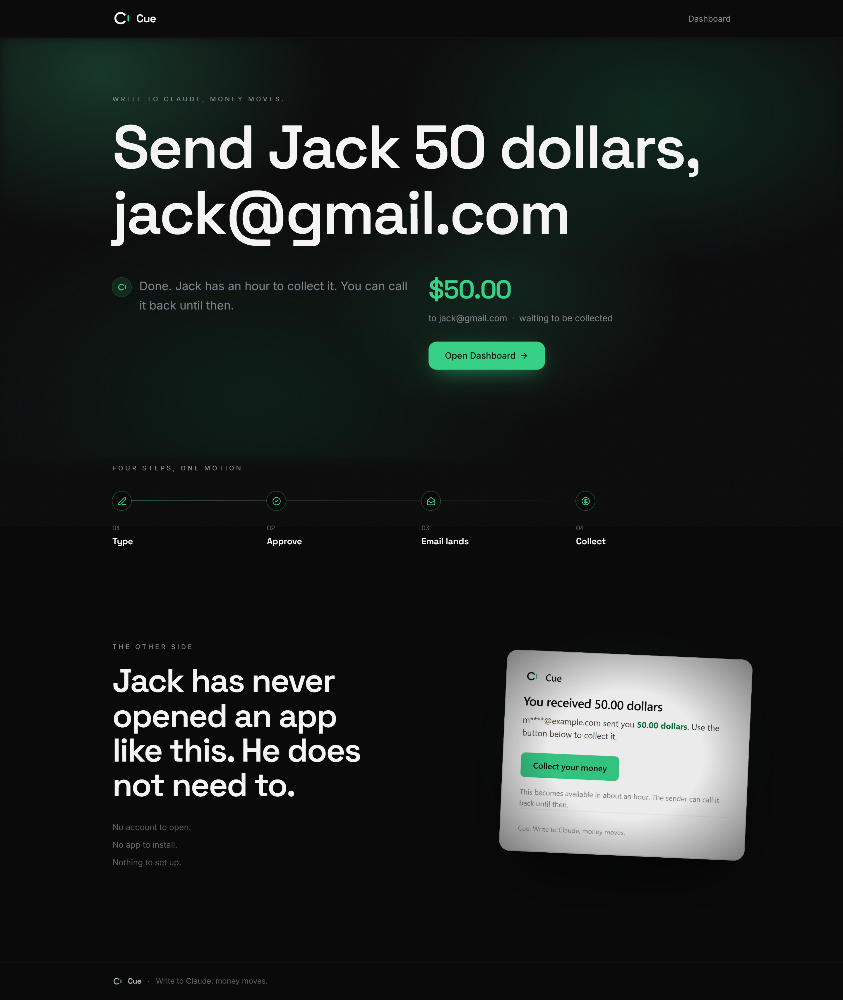
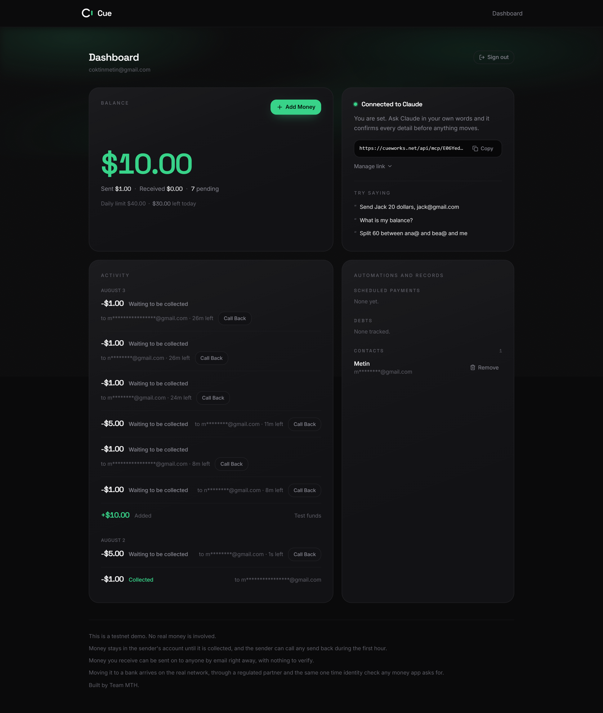

<div align="center">
  
  <h1>Cue</h1>
  <p>Send money by chatting with Claude. The person receiving it only needs an email address.</p>
  <p>
    <a href="https://cue-navy-psi.vercel.app">Live site</a>
    &nbsp;·&nbsp; Arc testnet (chain 5042002)
    &nbsp;·&nbsp; Circle hackathon submission
  </p>
</div>

## Live demo

**https://cue-navy-psi.vercel.app**

Runs on Arc testnet with test funds. No real money is involved.





## What it does

The sender types one sentence to Claude, for example "Send Jack 50 dollars, jack@gmail.com". A confirmation appears showing the amount and recipient, and the sender approves it. The money goes out to the recipient, and the sender has one hour to call it back before it can be collected. The recipient gets an email with a link, enters the address the money was sent to, and collects it. They do not install an app or set anything up first.

The words crypto, wallet and USDC never appear anywhere the user can see. To a sender and a recipient it is dollars, sending, and collecting.

## How it works

1. **Send.** A row is written to the `transactions` table with status `pending_claim`, a cryptographically random 32 byte claim token (43 url safe characters), and a `cancel_deadline` set to one hour ahead. No money moves on chain at this point.
2. **Hold.** Because funds stay in the sender account until collection, cancelling is a single conditional status update to `cancelled`. There is never an on chain reversal to unwind, which is what makes the one hour call back window safe.
3. **Claim gate.** Collecting requires both the claim token and a recipient email that matches the one the money was sent to, and it is only allowed once `cancel_deadline` has passed.
4. **Collect.** On a valid claim we find or create the recipient user, create a Circle wallet for them on Arc testnet if they do not have one, move the row to `claimed` with a conditional update so a claim and a cancel cannot both win, and only then transfer USDC from the treasury wallet to the recipient.
5. **Settlement handling.** The transfer is polled to a terminal state. A terminal failure releases the row back to `pending_claim` so it can be tried again, since no money moved. A timeout leaves the row `claimed` and reports that it is still settling, so a transfer is never sent twice.

## Circle and Arc usage

- **Circle Developer Controlled Wallets** for wallet sets, recipient wallet creation, balance reads and USDC transfers. Client setup in [`src/lib/circle/client.ts`](src/lib/circle/client.ts), all wallet and transfer operations in [`src/lib/circle/wallets.ts`](src/lib/circle/wallets.ts).
- **Arc testnet**, chain id `5042002`. USDC is the native gas token on Arc, so a wallet funded with USDC pays for its own transfers and there is no separate gas asset to manage. The chain identifier is taken from the SDK enum (`Blockchain.ArcTestnet`) rather than hardcoded, in [`src/lib/circle/client.ts`](src/lib/circle/client.ts).
- **Transaction status polling** with a timeout that fails loudly rather than silently, in `waitForTransaction` in [`src/lib/circle/wallets.ts`](src/lib/circle/wallets.ts). It throws on timeout instead of returning a half finished transfer, so callers cannot mistake pending for settled.
- **Circle Contracts** is planned next, for an on chain escrow contract that would hold funds during the call back window instead of holding them in the treasury account.

## Architecture

Three parts:

- **Backend business logic.** The send, cancel and collect flows, money handling and email, independent of the web layer, in `src/lib/cue/` and `src/lib/email/`. Exposed over API routes in `src/app/api/`.
- **Website.** Landing, claim and dashboard pages built with the App Router.
- **Claude tool.** A remote MCP server hosted in this app at `/api/mcp/<token>`, so a user adds it to Claude by pasting one URL, with nothing to install. It uses the Streamable HTTP transport and calls the backend directly. Six actions work today, the remaining six come in the next phase. A local stdio version is kept in `packages/mcp` for development.

Stack: Next.js 15, TypeScript, Tailwind v4, Supabase (Postgres), Circle Developer Controlled Wallets, Resend for email, Arc testnet, deployed on Vercel. The MCP server uses the Model Context Protocol Streamable HTTP transport.

```
src/
  app/
    page.tsx              Landing
    dashboard/            Balance, activity and the connect link
    claim/[token]/        Recipient collect page
    api/
      send/               POST create a send
      cancel/             POST call a send back
      claim/              POST collect, GET claim info
      account/            GET balance and totals
      activity/           GET recent activity
      transaction/[id]/   GET one send status
      resend/             POST resend the collection email
      mcp/[token]/        the remote MCP endpoint, one per connect token
  lib/
    circle/               Circle client, wallets, transfers, polling
    cue/                  send, cancel, claim, money, dashboard, actions, types
    email/                Resend client and templates
    mcp/                  tokens, signed confirmations, tools, JSON-RPC
    api/                  acting account, shared secret, rate limit, errors
    supabase/             server side Supabase client
supabase/migrations/      001_initial_schema.sql, 002_connect_tokens.sql
scripts/                  connection and end to end test scripts
packages/mcp/             local stdio MCP server, for development only
```

## Connect to Claude

This is the product. There is no config file to edit and nothing to install.

1. Open the [dashboard](https://cue-navy-psi.vercel.app/dashboard) and create your connect link. It looks like `https://cue-navy-psi.vercel.app/api/mcp/<token>`.
2. In Claude, open Settings, then Connectors, then Add custom connector.
3. Paste the link and save.

Then say something like "Send Jack 50 dollars, jack@gmail.com". Claude shows a preview of the amount and recipient and waits for your approval before the money moves.

The link is a credential. Anyone who has it can send from your account, so keep it private and use Revoke or Regenerate on the dashboard if it leaks.

### Identity and the security boundary

The account is resolved from the token in the URL on every request, in [`src/lib/mcp/tokens.ts`](src/lib/mcp/tokens.ts), and never from anything the client sends, so one person's connection cannot move another person's money. Proper OAuth, an authorization server with consent and short lived tokens, is the intended end state. It is a large security sensitive build, so for now the per user connect token is the boundary. The two step send and cancel confirmation uses tokens signed with the server secret, so it works on a stateless serverless endpoint and cannot be forged.

The `packages/mcp` stdio server is kept for local development only. See [`packages/mcp/README.md`](packages/mcp/README.md) for the tools, the confirmation design and how to verify without Claude Desktop. The remote URL above is the real path.

## Status

Honest state of the project.

**What works**

- The full send, cancel and collect flow with an email at every step, verified end to end with twelve checks in [`scripts/test-send-claim.ts`](scripts/test-send-claim.ts).
- Real USDC transfers settling on Arc testnet, triggered from production.
- Three pages deployed and live: landing, claim and dashboard.
- The MCP server with six actions: send money, call a send back, get balance, get history, check collect status and resend the collection link. Send and cancel require an explicit confirmation before money moves. Verified against production with the CLI in `packages/mcp/test`.

**In progress**

- The remaining six MCP actions.
- Contact memory so a name can map to an email.
- Sign in and account linking.
- The escrow contract on Arc using Circle Contracts.

There is no authentication yet, and the dashboard is a demo view that anyone can open. This is why the project stays on testnet with test funds only.

## Running it locally

**Prerequisites**

- Node.js 20 or newer and npm.
- A Circle developer account with Developer Controlled Wallets enabled, and a registered entity secret.
- A Supabase project.
- A Resend account.

**Environment variables**

Copy `.env.example` to `.env.local` and fill in each value.

| Variable | What it is | Where to get it |
| --- | --- | --- |
| `CIRCLE_API_KEY` | Circle API key | Circle developer console |
| `CIRCLE_ENTITY_SECRET` | 32 byte entity secret that secures your wallets | Generated and registered once via the Circle console |
| `CIRCLE_WALLET_SET_ID` | Wallet set every Cue wallet is created inside | Printed by `scripts/test-circle.ts` on first run |
| `TREASURY_WALLET_ID` | Wallet collections are paid out from | Printed by `scripts/test-circle.ts` |
| `TREASURY_WALLET_ADDRESS` | Address of the treasury wallet, funded from the Arc faucet | Printed by `scripts/test-circle.ts` |
| `NEXT_PUBLIC_SUPABASE_URL` | Supabase project URL | Supabase project settings, API |
| `NEXT_PUBLIC_SUPABASE_ANON_KEY` | Supabase publishable key | Supabase project settings, API |
| `SUPABASE_SERVICE_ROLE_KEY` | Supabase secret key, server only, bypasses row level security | Supabase project settings, API |
| `SUPABASE_DB_URL` | Session pooler connection string on port 5432, used only by the migration script | Supabase project settings, Database, connection string |
| `RESEND_API_KEY` | Resend API key for transactional email | Resend dashboard |
| `NEXT_PUBLIC_APP_URL` | Public base URL, used for claim links and the email logo | `http://localhost:3000` for local |
| `CUE_API_SECRET` | Shared secret required on `POST /api/send` | Any strong random string you choose |
| `CUE_MAX_SEND_USDC` | Largest amount a single send may move, in dollars | Set to `5` for testnet |
| `CUE_ALLOW_SHORT_WINDOW` | Allows cancel windows shorter than one hour, for tests | Set to `true` locally, leave unset in production |

**Set up the database**

Apply the schema. It creates the `users`, `transactions`, `scheduled_payments` and `email_logs` tables with row level security on and grants for the service role. It is safe to run more than once.

```
npx tsx scripts/apply-migration.ts
```

**Create the Circle wallets**

This creates the wallet set, a treasury wallet and a test recipient wallet, and prints the ids and addresses to put in `.env.local`. Fund the treasury address from the Circle Arc testnet faucet.

```
npx tsx --conditions=react-server scripts/test-circle.ts
```

**Run the test scripts**

```
npx tsx --conditions=react-server scripts/test-supabase.ts     # database connection
npx tsx --conditions=react-server scripts/test-transfer.ts     # one USDC transfer on Arc, polled to settlement
npx tsx --conditions=react-server scripts/test-send-claim.ts you@example.com   # full send, collect and cancel loop
```

The `--conditions=react-server` flag is required because the library modules are marked server only and throw under any other resolution condition. In test mode Resend can only deliver to the account owner address, so use your own Resend email for `test-send-claim.ts`.

**Start the dev server**

```
npm install
npm run dev
```

Open `http://localhost:3000`.

## Security notes

- Testnet only, with test funds. No real money is involved.
- There is no authentication yet. Sign in ships in a later release.
- `POST /api/send` is protected by a shared secret in the `x-cue-secret` header as an interim measure until real auth lands. The MCP server will use the same secret.
- There is a per send amount cap and an in memory per IP rate limit on the send and claim endpoints.
- All keys currently in use are testnet keys and will be rotated before any mainnet use.

## Team

Team MTH:

- [@0xmeto_](https://x.com/0xmeto_)
- [@isaac_inya](https://x.com/isaac_inya)
- [@itztotoriboy](https://x.com/itztotoriboy)
- [@artology04](https://x.com/artology04)
